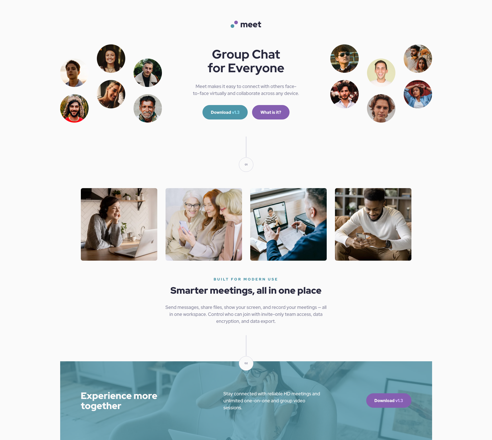

# Frontend Mentor - Meet landing page solution

This is a solution to the [Meet landing page challenge on Frontend Mentor](https://www.frontendmentor.io/challenges/meet-landing-page-rbTDS6OUR).

## Table of contents

- [Overview](#overview)
  - [The challenge](#the-challenge)
  - [Screenshot](#screenshot)
  - [Links](#links)
- [My process](#my-process)
  - [Built with](#built-with)
  - [What I learned](#what-i-learned)
- [Author](#author)

## Overview

### The challenge

Users should be able to:

- View the optimal layout depending on their device's screen size
- See hover states for interactive elements

### Screenshot

### Links

- Solution URL: [https://github.com/LukasT1/fm-easy-meet-landing-page]
- Live Site URL: [https://LukasT1.github.io/fm-easy-meet-landing-page/]

## My process

### Built with

- Semantic HTML5 markup
- CSS custom properties
- Flexbox
- CSS Grid
- Desktop-first workflow
- SCSS

### What I learned

This was more of a refresh for me on various concepts used previously. No major setbacks encountered. Try to spiced it up with some simple animations using @keyframes

## Author

- Frontend Mentor - [@https://www.frontendmentor.io/profile/LukasT1]
